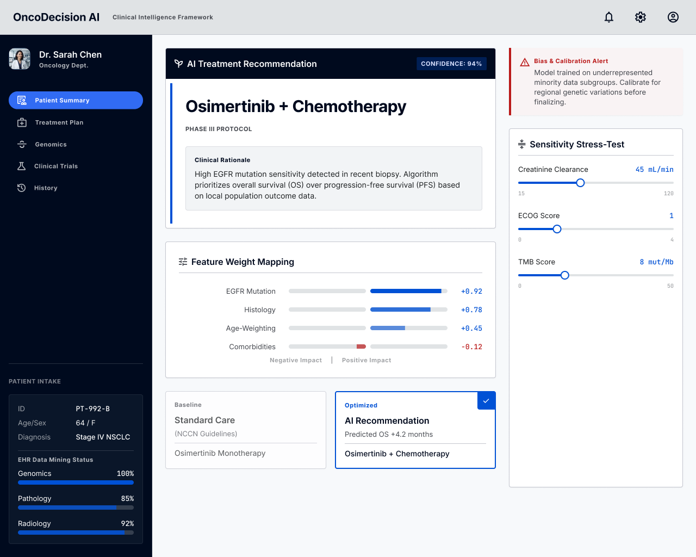
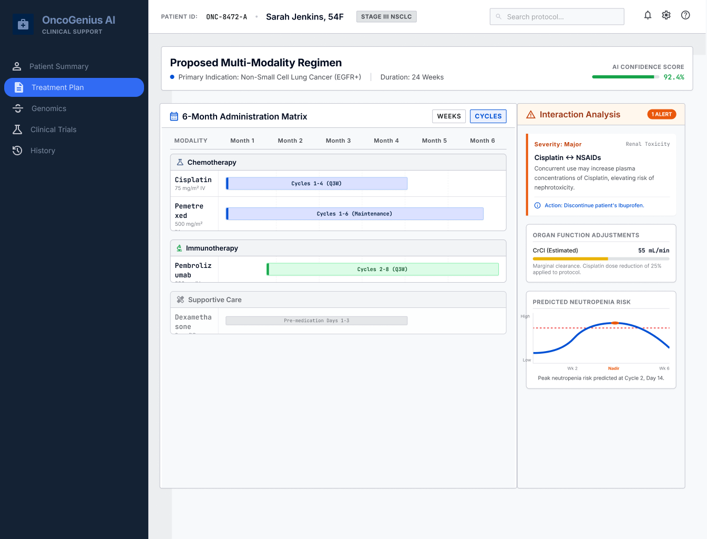
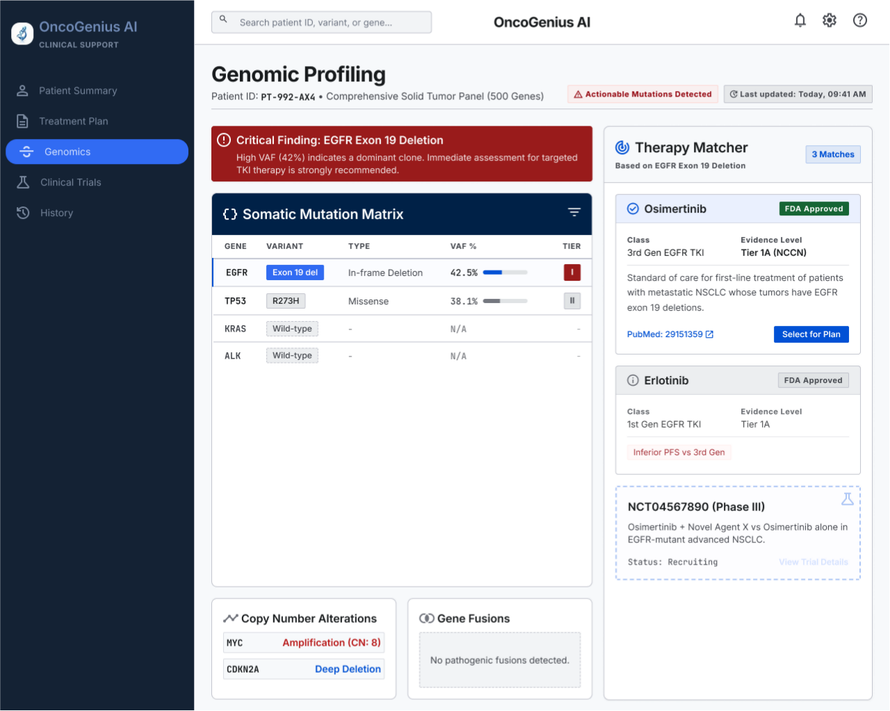
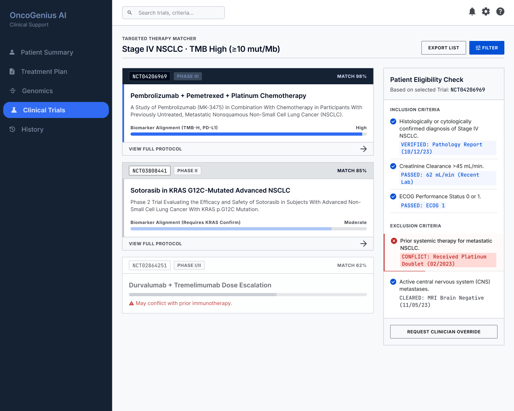

# OncoGenius AI (Internship Project)

A UI/UX design project — a Figma file and page previews — created during my **UI/UX Design internship** at **Codtech IT Solutions Pvt. Ltd.**

## Internship Details

- **Organization:** Codtech IT Solutions Private Limited
- **Role:** UI/UX Design Intern
- **Intern ID:** CITS7653

## About

This repository holds the Figma source file (`User_Persona_Development.fig`) along with page preview screenshots, designed for **OncoGenius AI** — a concept clinical decision-support dashboard for oncology, covering patient summaries, treatment planning, genomic profiling, clinical trial matching, and historical case analysis.

## Design Previews

### Dashboard

### Treatment Plan

### Genomics Deep-Dive

### Clinical Trials Matcher

### Historical Case Matrix

## Files

- `User_Persona_Development.fig` — Original Figma project file. Open it with [Figma](https://www.figma.com) to view or edit.
- `designs/` — PNG previews of each screen in the design.

## How to open the Figma file

1. Download `User_Persona_Development.fig` from this repository.
2. Go to [figma.com](https://www.figma.com) and log in (or create a free account).
3. Click **Import** and select the downloaded `.fig` file.
